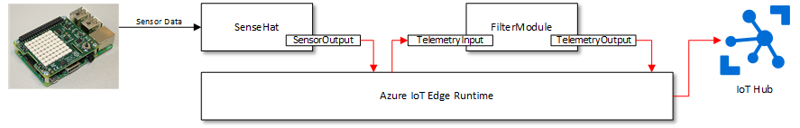
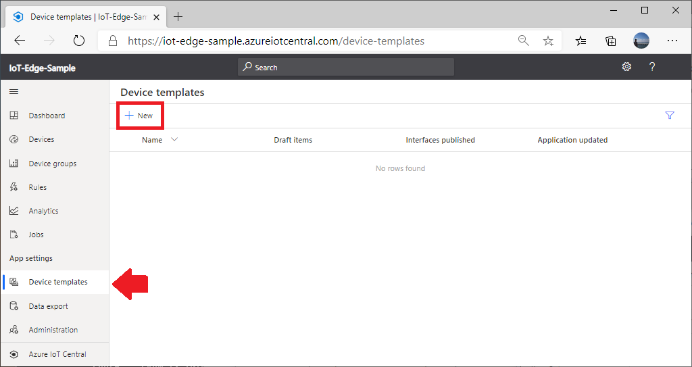
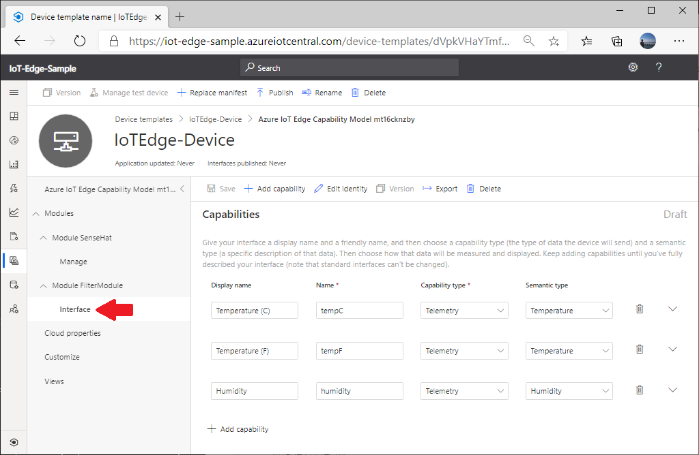
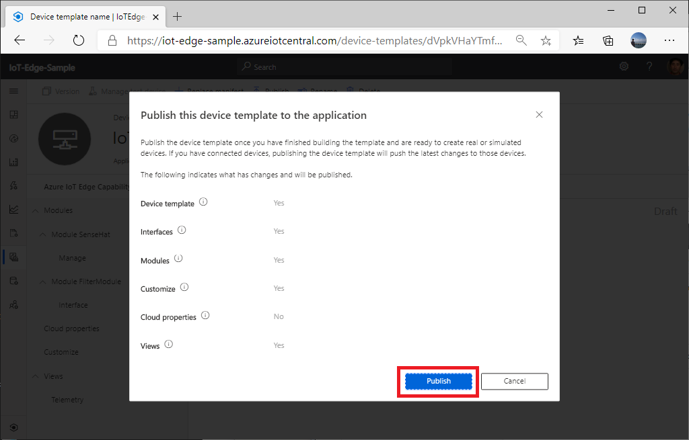

# Setting up IoT Edge with IoT Central Application

Example of setting Azure IoT Edge module in IoT Central app.

## Requirements

1. Azure IoT Central Preview Application
1. Raspberry Pi 3/4
1. Optional : [SenseHat](https://www.raspberrypi.org/products/sense-hat/)

## Assumption

This instruction assumes followings :

- The repo is cloned into `C:\RP4_SenseHat`
- SenseHat is available  
    If you do not have SenseHat, please use Simulator version

## Azure IoT Edge Modules

Two Azure IoT Edge Modules are used for this sample

### SenseHat Module

- Reads sensor data from SenseHat
- Sends telemetry with Temperature and Humidity
- Temperature unit can be configured through module twin (Celsius vs. Fahrenheit)
- Can receive a command from IoT Central

Example of Telemetry from SenseHat Module

```json
Message Out : {"humidity":29.28,"tempF":95.80}
```

### Filter Module

This is an example of intercepting messages and process telemetry data

- Receives telemetry from SenseHat module
- Converts telemetry to contain both Celsius and Fahrenheit

Example of Telemetry from Filter Module

```json
Message In  : {"humidity":29.47,"tempF":95.87}
Message Out : {"humidity":29.47,"tempC":35.48,"tempF":95.87}
```

- Message In  

    Telemetry from SenseHat module

- Message Out

    Telemetry to Cloud (IoT Central)

## Message Routes

Telemetry Message Routes are defined in `deployment.arm32v7.json` in **dotnet/App.IoTEdge/config** as follows :

```json
    "$edgeHub": {
      "properties.desired": {
        "schemaVersion": "1.0",
        "routes": {
          "SenseHatToFilter": "FROM /messages/modules/SenseHat/outputs/SensorsOutput INTO BrokeredEndpoint(\"/modules/FilterModule/inputs/TelemetryInput\")",
          "FilterModuleToCloud": "FROM /messages/modules/FilterModule/outputs/TelemetryOutput/* INTO $upstream"
        },
```

1. SenseHat module reads sensor data every 3 seconds
1. SenseHat module creates a message with **Temperature** and **Humidity**
1. SenseHat module sends the message through **SenseorOutput**
1. FilterModule receives the message through **TelemetryInput**
1. FilterModule processes the message
1. FilterModule sends the message to IoT Hub through **TelemetryOutput**



## Setting Up Raspberry Pi

If you have SenseHat, we need to enable I2C and SPI interfaces.

1. Install Raspbian Buster  

    Recommended : [Debian Buster Lite](https://downloads.raspberrypi.org/raspios_lite_armhf_latest)

1. Configure Raspbian with  

    ```bash
    sudo apt-get update && \
    sudo apt-get install -y git && \
    sudo raspi-config nonint do_expand_rootfs && \
    sudo raspi-config nonint do_memory_split 16 && \
    sudo raspi-config nonint do_spi 0 && \
    sudo raspi-config nonint do_i2c 0 && \
    sudo raspi-config nonint do_wifi_country US && \
    sudo raspi-config nonint do_change_locale en_US.UTF-8 && \
    sudo raspi-config nonint do_configure_keyboard us && \
    sudo raspi-config nonint do_change_timezone US/Pacific && \
    sudo reboot now
    ```

## Setting Up IoT Central App

Ensure you use "Preview Application" (As of June 2020).

1. Browse to <https://apps.azureiotcentral.com/>  

    Please sign in to your Azure subscription

1. Create a new **Custom App**

1. Ensure to select **Custom application**, not **Custom application (legacy)**

    [Instruction](https://docs.microsoft.com/en-us/azure/iot-central/core/quick-deploy-iot-central)

    

1. Wait for the new application to provision

## Creating a new device template with Deployment Manifest

1. Select **Device templates**, then click `+ New`

    

1. Select **Azure IoT Edge** tile and click `Next: Customize`

    

1. Give a name to the new template (e.g. IoTEdge-Device)

1. Click `Browse`

    

1. Browse to **deployment.arm32v7.json** file  

    - With SenseHat, `C:\RP4_SenseHat\dotnet\App.IoTEdge\config\SenseHat`
    - Without SenseHat, `C:\RP4_SenseHat\dotnet\App.IoTEdge\config\Simulation`

1. Click `Next: Review`

    

1. Click `Create`

    

1. Wait until the new template is created

    

## Customize Device Template

The new device template created with Azure IoT Edge deployment manifest has modules and module twins.


We need to add followings :

- Interfaces for Telemetry
- Telemetry View
- UI Customization

## Telemetry Interfaces

SenseHat module generates telemetry messages every 3 seconds in the following format :

```json
{"humidity":26.65,"tempC":39.91}
```

or

```json
{"humidity":26.65,"tempF":39.91}
```

Filter Module adds temperature telemetry in Fahrenheit or Celsius (whichever missing one), then sends telemetry messages in the following format :

```json
{"humidity":26.65,"tempC":39.91,"tempF":39.91}
```

These telemetry interfaces are not defined in the deployment template, therefore, we need to add them to the device template.

## Adding Telemetry Interfaces

Since telemetry messages are received from **FilterModule**, we need to add telemetry interfaces to **FilterModule**

1. Browse to the device template just created

    **Device templates** -> **Module FilterModule** -> **+ Add interface**

    

1. Click `Custom`

    

1. Click `+ Add capability`

    

1. Add following capabilities

    |Display name    |Name     |Capability type | Semantic type | Schema | Unit |
    |----------------|---------|----------------|---------------|--------|------|
    |Temperature (C) |tempC    |Telemetry       |Temperature    |Double  |&deg;C|
    |Temperature (F) |tempF    |Telemetry       |Temperature    |Double  |&deg;F|
    |Humidity        |humidity |Telemetry       |Humidity       |Double  |%     |

    

    > [!TIP]
    > You can create the interface by importing the exported template in `C:\RP4_SenseHat\dotnet\Device_Templates\FilterModule_Interface.json`

1. Click `Save`

    You should see new **interface** under **Module FilterModule**

    

## Setting right schema for Module Twin

SenseHat has a Module Twin boolean value called **iSCelsius** to select the temperature in celsius or fahrenheit.   
This capability is read from the deployment manifest :

```jason
    "SenseHat": {
      "properties.desired": {
        "isCelsius": true
      }
    }
```

In order to send the collect data to the device, ensure the schema for **isCelsius** is set to boolean value.

1. Browse to **Manage** page of **Module SenseHat**

    

1. Change **Display Name** to something more user friendly

    e.g. **Report in Celsius**

    

    > [!IMPORTANT]
    > Make sure **Name** stays as `isCelsius` (case sensitive)

1. Click `Save` to save the change

    

## Adding View

The device template has no views by default.  Since we are expecting to receive telemetry, add a view to show temperature and humidity

1. Browse to **Views** then select **Visualizing the device**

    

1. Edit the new view with following settings

    |Element     |Setting   |Notes  |
    |------------|----------|--------|
    |View name   |Telemetry |        |
    |Humidity    |Add tile  |        |
    |Temperature |Add tile  |Select both temperature telemetries to add a combined chart |

1. Format the view as appropriate

    - Adjust tile size
    - Change color (you can change details of tiles by clicking **gear** icon on the top right of tiles)

    

1. Click `Save` to save the change

## Adding Command capability

SenseHat module is capable of receiving a command from cloud.  The  **displayMessage** command receives string and display on SenseHat's LED.

1. Browse to **Manage** page under **Module SenseHat**

    

1. Add a new capability with following settings
    
    |Setting         |Value            |Notes           |
    |----------------|-----------------|----------------|
    |Display Name    |Display Message  |                |
    |Name            |displayMessage   | Case sensitive |
    |Capability Type |Command          |                |
    |Command Type    |Synchronous      |                |
    |Request         |Enable           |                |
    |Display Name    |Message Text     |                |
    |Name            |MessageText      |                |
    
    

1. Click `Save` to save the change

## Publishing the device template

The device template you created is in a draft state.  In order to use this device template to connect devices, the device template must be published.

1. Click `Publish` to publish the device template

    

1. Click `Publish` to confirm

    

Now the device template is ready to add devices

## Creating a new device identity

In order to connect a device, a new device identity needs to be created.  Each device identity must be associated with a device template.

1. Browse to **Devices** page
1. Click `+ New` to add a new device identity

    You should see the device template you published

    

1. Create a new device identity with following settings :

    |Setting               |Value                                 |
    |----------------------|--------------------------------------|
    |Template Type         |IoT Edge Device template just created |
    |Device Name           |User friendly device name for UI      |
    |Device ID             |Unique ID for each device             |
    |Simulate this device? |No                                    |

    

1. Click `Create` to create a new device identity

1. The new device identity should be listed as follows :

    

Your IoT Central application is now ready for devices to connect

## Installing Azure IoT Edge

Install Docker and Azure IoT Edge runtime on Raspbian Buster with :

```bash
sudo apt-get update && \
sudo apt-get install libssl1.0.2 && \
sudo apt-get install moby-engine && \
sudo apt-get install moby-cli && \
curl https://packages.microsoft.com/config/debian/stretch/multiarch/prod.list > ./microsoft-prod.list && \
sudo cp ./microsoft-prod.list /etc/apt/sources.list.d/ && \
curl https://packages.microsoft.com/keys/microsoft.asc | gpg --dearmor > microsoft.gpg && \
sudo cp ./microsoft.gpg /etc/apt/trusted.gpg.d/ && \
sudo apt-get update && \
sudo apt-get -y install iotedge && \
rm microsoft.*
```

For other platformns, please install Azure IoT Edge runtime on your device by following [the online instruction](https://docs.microsoft.com/en-us/azure/iot-edge/how-to-install-iot-edge-linux) 

## Configuring Azure IoT Edge runtime

In order for Azure IoT Edge to connect to IoT Hub/IoT Central, provisioning information needs to be entered into `/etc/iotedge/config.yaml`

1. Click on **Device Name** in **Devices** view to open device detail page

1. Click on **Connect**

    

    

1. Open `/etc/iotedge/config.yaml` in your device (Raspberry Pi) with a text editor (e.g. vi, nano editor)

    e.g.

    ```bash
    sudo nano /etc/iotedge/config.yaml
    ```

1. Scroll down until you find lines for **Manual Provisioning**

    Comment out 3 lines by adding `#` to the beginning of lines

    

1. Uncomment lines for **dps** provisioning

    Uncomment 8 lines by removing `#` and 1 space

    > [!IMPORTANT]  
    > It is important to use right indention (2 paces) in yaml file

1. Enter values from step above

    - scope_id : Value of **ID scope**
    - registration_id : Value of **Device ID**
    - symmetric_key : Value of one of **Primary** or **Secondary** key

1. Save and close `/etc/iotedge/config.yaml`

1. Restart Azure IoT Edge for the change to be consumed with :

    ```bash
    sudo systemctl restart iotedge
    ```
    
1. Once Azure IoT Edge runtime restarts and connects to IoT Central application, status of the deivce should become **Provisioned** from **Registered**

    

    

## Confirm device connection

Within a few minutes, you should start seeing telemetry data in **Telemetry** view


## Communicating with the device (or module)

### Module Twin (Property)

The module twin setting **isCelsius** can be set via cloud.  The setting can be controlled via **Manage** tab in IoT Central.


1. Open docker log (or logs from modules) with :

    SenseHat Module

    ```bash
    docker logs -f SenseHat
    ```

    Filter Module

    ```bash
    docker logs -f FilterModule
    ```

1. Change setting of **Report in Celsius** in **Manage** tab, then click `Save`

    You should see the change is received by SenseHat module and the telemetry change from tempC to tempF (or vice versa)


### Comamand

Under **Commands** tab, type any test in **Message Text** field then click `Run`


You should see typed message string on LED, if you have SenseHat.

In SenseHat module log, you can see following logs :

```bash
Message Out : {"humidity":29.24,"tempC":35.20}

*** displayMessage was called.
"Test Message"
Message Out : {"humidity":29.13,"tempC":35.05}

```