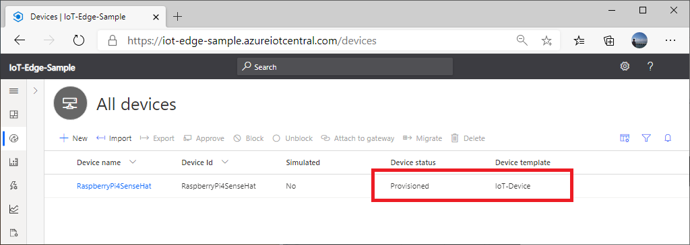

# SenseHat + RP4 + Dotnet Core Sample

Example of setting up Azure IoT Hub device client in IoT Central app

## Requirements

- Azure Subscription
- Azure IoT Central Preview Application
- Raspberry Pi 3 or 4
- Optional : [SenseHat](https://www.raspberrypi.org/products/sense-hat/)
- Dotnet Core SDK 3.1.300

  - Tested with dotnet-sdk-3.1.300-linux-arm.tar.gz

## Assumption

This instruction assumes followings :

- The repo is cloned into `C:\RP4_SenseHat`
- SenseHat is available  
    If you do not have SenseHat, please use Simulator version

## Azure IoT Hub Device Client Application

The sample application implements following functionalities

- Reads sensor data from SenseHat  

  - If you do not have SenseHat, please set `_hasSenseHat` to false in `dotnet/App/IoTHubDeviceClient.cs`

- Builds message with **Temperature** and **Humidity**  

- Receives and processes Device Twin

  - Temperature unit is controlled by `isCelcius` device twin desired property

- Receives a command 'displayMessage' to display message string on SenseHat's LED

## Setting Up Raspberry Pi

If you have SenseHat, we need to enable I2C and SPI interfaces.

1. Install Raspbian Buster  

    Recommended : [Debian Buster Lite](https://downloads.raspberrypi.org/raspios_lite_armhf_latest)

1. Configure Raspbian with  

    ```bash
    sudo apt-get update && \
    sudo apt-get install -y git && \
    sudo raspi-config nonint do_expand_rootfs && \
    sudo raspi-config nonint do_memory_split 16 && \
    sudo raspi-config nonint do_spi 0 && \
    sudo raspi-config nonint do_i2c 0 && \
    sudo raspi-config nonint do_configure_keyboard us && \
    sudo raspi-config nonint do_wifi_country US && \
    sudo raspi-config nonint do_change_locale en_US.UTF-8 && \
    sudo raspi-config nonint do_change_timezone US/Pacific && \
    sudo reboot now
    ```

1. Download .Net Core SDK and expand to ~/dotnet with :  

    ```bash
    cd /tmp && \
    wget https://download.visualstudio.microsoft.com/download/pr/f2e1cb4a-0c70-49b6-871c-ebdea5ebf09d/acb1ea0c0dbaface9e19796083fe1a6b/dotnet-sdk-3.1.300-linux-arm.tar.gz
    mkdir -p $HOME/dotnet && \
    tar zxf dotnet-sdk-3.1.300-linux-arm.tar.gz -C $HOME/dotnet && \
    rm -rf dotnet-sdk-3.1.300-linux-arm.tar.gz && \
    echo export DOTNET_ROOT=$HOME/dotnet >> $HOME/.bashrc && \
    echo export PATH=$PATH:$HOME/dotnet >> $HOME/.bashrc
    ```

1. Clone the repo and copy library files from SenseHatNet with :

    ```bash
    cd ~/ && \
    git clone -b WIP https://github.com/daisukeiot/RP4_SenseHat.git && \
    cd /tmp && \
    git clone https://github.com/johannesegger/SenseHatNet.git && \
    cp SenseHatNet/Sense/Native/libRTIMULibWrapper.so $HOME/RP4_SenseHat/dotnet/App  && \
    cp SenseHatNet/Sense/Native/libRTIMULib.so.7 $HOME/RP4_SenseHat/dotnet/App  && \
    rm -rf SenseHatNet
    ```

## Building the sample app

Build and publish the sample app with :

```bash
cd $HOME/RP4_SenseHat/dotnet/App && \
export DOTNET_ROOT=$HOME/dotnet && \
export PATH=$PATH:$HOME/dotnet && \
dotnet restore && \
dotnet publish -c release
```

## Setting up IoT Central App

A device template in Azure IoT Central is a blueprint that defines the characteristics and behaviors of a type of device that connects to your application. For example, the device template defines the telemetry that a device sends so that IoT Central can create visualizations that use the correct units and data types.

More on [Device Templates](https://docs.microsoft.com/en-us/azure/iot-central/core/concepts-device-templates)

### Creating a new Device Template

1. Browse to **Device templates** page of your IoT Central Application, then click `+ New`

    

1. Select **IoT Device** from template type, then click `Next: Customize`

    

1. Give a name to the new device template (e.g. IoT-Device), then click `Next: Review`

    

1. Click `Create` to create a new device template

    

1. Wait for a new device template to be created

    

1. Once a new empty device template, click `Custom` to add capability model

    

## Adding Capabilities

The sample device client app is capable of :

- Send telemetry
- Receive Device Twin changes to select temperature unit (F or C)
- Receive a command

### Adding Telemetry

1. Click `+ Add interface`

    

1. Select `Custom`

    

1. Click `+ Add capability` to add new telemetry capabilities as follows :

    

    - Temperature in Celsius

    |Setting        |Value           |Notes         |
    |---------------|----------------|--------------|
    |Display Name   |Temperature (C) |              |
    |Name           |tempC           |case sensitive|
    |Capability type|Telemetry       |              |
    |Semantic type  |Temperature     |              |
    |Schema         |Double          |              |
    |Unit           |&deg;C          |              |

    - Temperature in Fahrenheit

    |Setting        |Value           |Notes         |
    |---------------|----------------|--------------|
    |Display Name   |Temperature (F) |              |
    |Name           |tempF           |case sensitive|
    |Capability type|Telemetry       |              |
    |Semantic type  |Temperature     |              |
    |Schema         |Double          |              |
    |Unit           |&deg;F          |              |

    - Humidity

    |Setting        |Value           |Notes         |
    |---------------|----------------|--------------|
    |Display Name   |Humidity        |              |
    |Name           |humidity        |case sensitive|
    |Capability type|Telemetry       |              |
    |Semantic type  |Humidity        |              |
    |Schema         |Double          |              |
    |Unit           |%               |              |

    

1. Click `Save` to save new capabilities

### Adding Property (Device Twin)

The sample app listens for Device Twin Desired Property for `isCelsius` property.  This is a way to manage device fro cloud.  

1. Click `+ Add capability`

    

1. Add a new **Property** capability as follows :

    |Setting        |Value           |Notes         |
    |---------------|----------------|--------------|
    |Display Name   |Temperature Unit|              |
    |Name           |isCelsius       |case sensitive|
    |Capability type|Property        |              |
    |Semantic type  |None            |              |
    |Schema         |Boolean         |              |
    |Writable       |On              |              |
    |Unit           |None            |              |

    

1. Click `Save` to save the new property capability

### Adding Command

The sample app listens for Direct Method (or Command) to display messages on LED.  With commands, you can communicate with a device in both synchronous and asynchronous way.

1. Click `+ Add capability`

    

1. Add a new **Property** capability as follows :

    |Setting        |Value           |Notes         |
    |---------------|----------------|--------------|
    |Display Name   |Display Message |              |
    |Name           |displayMessage  |This is the command name. case sensitive|
    |Capability type|Command         |              |
    |Command Type   |Synchronous     |              |
    |Request        |On              |              |
    |DisplayName    |Message         |              |
    |Name           |message         |              |
    |Schema         |String          |              |

    

1. Click `Save` to save the new property capability

At this point, the new device template should have :

- 3 x Telemetry Capabilities
- 1 x Property Capability
- 1 x Command Capability

## Adding views

Add charts for telemetry, Device setting page for Property, and Command page to send command

1. Select `Views`, then select `Visualizing the device` to add charts for telemetry data

    

1. Give a name to the new view (e.g. Telemetry)

1. Select both Temperature telemetries to add a combined chart, then click `Add tile`

1. Select Humidity, then click `Add tile`

    

1. Customize tiles such as tile size, line colors for each telemetry data point

    You can configure details of each tile by clicking `gear icon` on the top right of each tile

    

1. Click `Save` to save the view

1. Browse to `Views` again, then select `Editing device and cloud data` to add Property form

    

1. Give a name to the form (e.g. Setting)

1. Select `Temperature Unit` and click `Add selection`

    

1. Click `Save` to save the new form

## Customize

**Temperature Unit** property is a boolean value.  To make more user friendly, let's customize the view

1. Browse to `Customize`

1. Expand line for `Temperature Unit` property by clicking down arrow on the right

1. Enter `Celsius` for `True name` and `Fahrenheit` for `False name`

    

1. Click `Save` to save the change

## Publish the device template

The new device template is in **Draft** state.  In order to connect devices, the device template needs to be **published**

1. Click `Publish` to publish the device template

    

1. Notice the device template is now **Published** state

    

## Device Connection Credential

Each device must be authenticated to be a part of a solution.  In order to be authenticated, the device app must provide device credential to IoT Central.

IoT Central supports following authentication methods :

- Shared Access Signature (SAS)
- X.509 certificates
- DPS provisioning

More on IoT Central's device authentication methods : <https://docs.microsoft.com/en-us/azure/iot-central/core/concepts-get-connected>

The sample app uses [Connect without registering devices](https://docs.microsoft.com/en-us/azure/iot-central/core/concepts-get-connected#connect-without-registering-devices)

The sample app needs :

- SAS Token
- ID scope
- Device ID

These parameters are passed via environment variables

1. Retrieve ID Scope and SAS key 

    In IoT Central, Administration -> Device Connection => ID Scope and SAS Tokens

    

1. Set environment variable

    ```bash
    export DPS_IDSCOPE=<IS Scope from IoT Central>
    export SAS_KEY=<SAS Token from IoT Central>
    ```

    > [!NOTE]  
    > Device ID is hardcoded in the app as `RaspberryPi4SenseHat` in `dotnet/App/Program.cs`  
    > If you would like to connect multiple devices, ensure to change the device id for each device

1. Run the app with :

    ```bash
    cd $HOME/RP4_SenseHat/dotnet/App
    dotnet ./bin/release/netcoreapp3.1/publish/RP4SenseHat.csharp.dll
    ```

    > [!NOTE]  
    > Please make sure .Net folders are in PATH variable  
    > Please refer step [above](#building-the-sample-app)  

    ```bash
    pi@raspberrypi:~/RP4_SenseHat/dotnet/App $ dotnet ./bin/release/netcoreapp3.1/publish/RP4SenseHat.csharp.dll
    Provisioning...
    Connection Key : 2+TaTjYxK26rihOthhcerT/xSA0zNEz1n63Ekjgf/9k=
    Device ID      : RaspberryPi4SenseHat
    Provisioned    : Assigned
      Device ID    : RaspberryPi4SenseHat
      IoT Hub      : iotc-76eb00e1-8508-499a-a992-a6cb7102618f.azure-devices.net
    SenseHat Device Client : Has SenseHat : True
    ```

## Associate the device with the device template

After the sample app successfully provisioned, the device will start sending telemetry.  However, the device is not yet associated with any device template

1. Browse to `Devices` and check `Device status`

    It's **Unassocated** status

    

1. Select the device and click `Migrate`

    

1. Select the device template then click `Migrate`

    

1. Confirm the deivce is now associated with the device template

    

## Viewing Telemetry and interacting with the device

Click on the new device `RaspberryPi4SenseHat`

In a few minutes, you should see Temperature and Humidity under `Telemetry` tab

    

## Sending a setting via Device Twin

The initial setting of `isCelsius` setting is `True`, therefore, temperature telemetry is sent in Celsius. 

Change temperature unit from Celsius to Fahrenheit by sending settings via Device Twin.

1. Under `Setting` tab (or the name of Property form you created [above](#adding-property-device-twin))

1. Change setting from Fahrenheit to Celsius (or vice versa), then click `Save`

    Temperature unit will switch between Celsius and Fahrenheit

    

1. Confirm Device Twin change is communicated to the device in app's log

```bash
Message Out : {"humidity":29.05,"tempC":37.96}
Message Out : {"humidity":28.80,"tempC":38.03}

Desired property (Settings) changed:
{
  "isCelsius": {
    "value": false
  },
  "$version": 5
}
Message Out : {"humidity":29.20,"tempF":100.33}
Message Out : {"humidity":28.99,"tempF":100.16}
```

## Sending Command (Direct Method)

1. Browse to `Command` tab

1. Enter any string to display on LED

1. Click `Run`

1. Confirm the message string is displayed on LED and app's log shows the command reception

```bash
Message Out : {"humidity":29.18,"tempF":100.19}

*** displayMessage was called.
"test message"
Message Out : {"humidity":29.05,"tempF":100.29}
Message Out : {"humidity":28.22,"tempF":100.33}
```